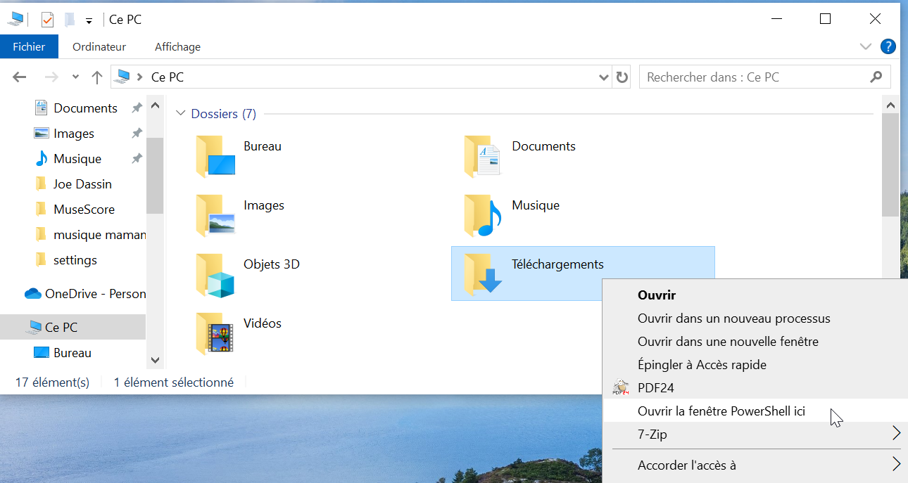

# Installation de python et des librairies
Si ça ne vous intéresse pas de savoir quelles étapes suivre pour l'installation, vous pouvez simplement télécharger et exécuter les scripts suivants:
- [Windows](./installation_files/Windows.ps1)
- [Linux - Debian/Ubuntu](./installation_files/Linux - Debian_Ubuntu.sh) (nécessite les droits administrateurs, doit être exécuté en sudo)
- [Linux - Fedora](./installation_files/Linux - Fedora.sh) (nécessite les droits administrateurs, doit être exécuté en sudo)

Sinon, c'est ici que ça se passe
## Installation de python
### Windows
Télécharger le programme python depuis [le lien officiel] (https://www.python.org/downloads/)  
Sous Windows, il est recommandé de sélectionner l'option "ajouter Python au PATH". En cas de question d'installation consulter [la documentation](https://docs.python.org/3/using/windows.html#installation-steps)
### Linux - Debien/Ubuntu
> sudo apt install python3

### Linux - Fedora

> sudo dnf install python3
## Installation de pip
### Sous Windows
Si pip n'a pas été installé avec Python:  
Télécharger le script afin d'installer pip depuis [ce lien](https://bootstrap.pypa.io/get-pip.py)  
Ouvrir le Powershell (Windows) dans le dossier où a été téléchargé le script (Shift + Click droit sur le dossier)
  
<!---->
Puis dans la fenêtre du Terminal/PowerShell, exécuter la commande suivante:  
> python .\get-pip.py
### Linux - Debian/Ubuntu
Il est possible de télécharger le même script que pour l'[installation de pip sous Windows](#sous-windows) et d'exécuter la même commande dans le Terminal.  
Autrement, l'installation par le gestionnaire de package est aussi possible  
> sudo apt install python3-pip
### Linux - Fedora
Il est possible de télécharger le même script que pour l'[installation de pip sous Windows](#sous-windows) et d'exécuter la même commande dans le Terminal.  
Autrement, l'installation par le gestionnaire de package est aussi possible  
> sudo dnf install python3-pip
## Installation de la librairie GUI avec pip
Toujours dans la fenêtre de commande, exécuter dans la commande suivante  
> pip install tk
## Installation de la librairie GUI avec conda
Dans le cas où Python était déjà installé et géré par Anaconda, la commande à exécuter dans le Anaconda Shell est:
> conda install -c anaconda tk
Invoke-WebRequest -Uri $url -OutFile $dest
