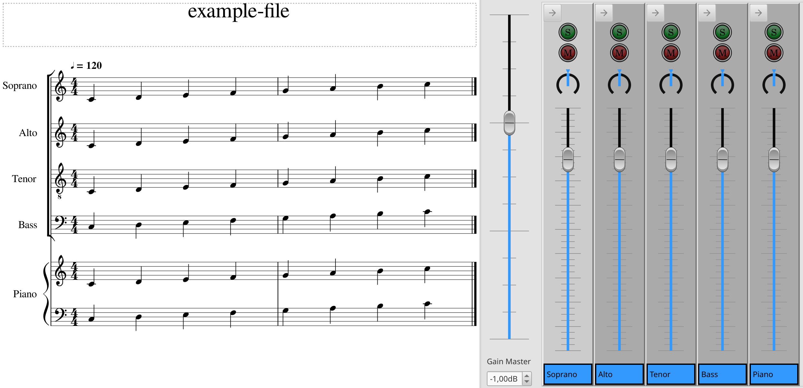
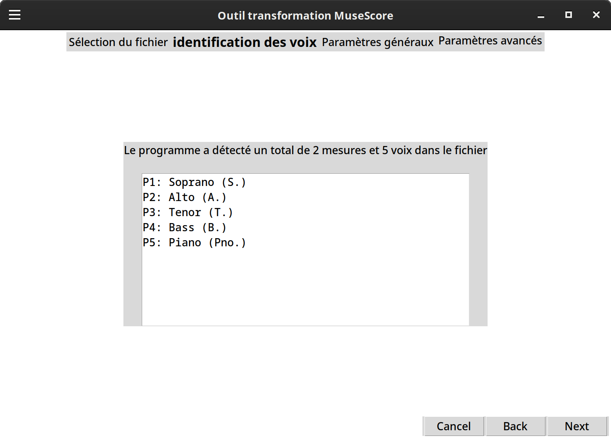
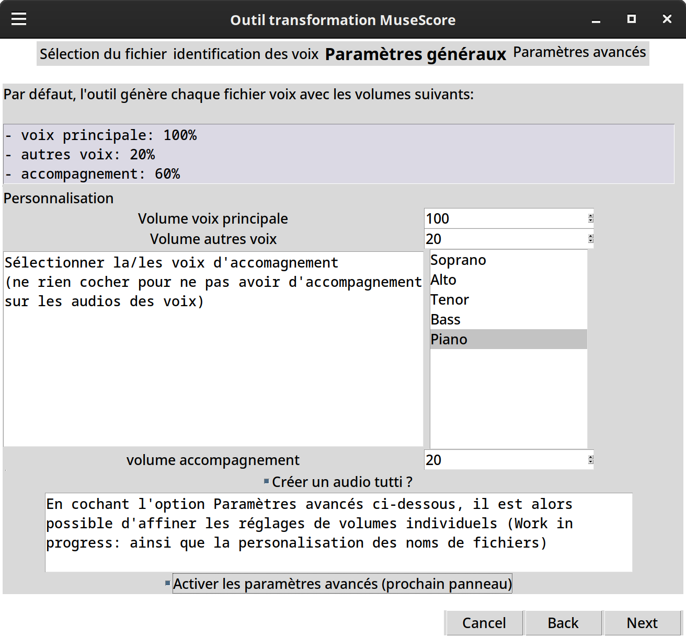
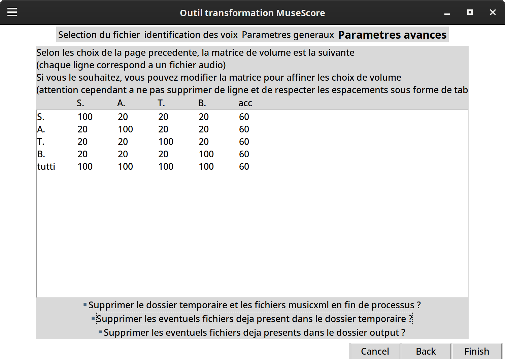

# audio file generator

## Description
This project aims to reduce the time needed to generate work audio files from a MuseScore file.
Indeed, when converting a mscz file into a bunch of mp3 work files, one needs to adjust the volume of all the tracks on the MS mixer, do one conversion, make another adjustment, conversion and so on. It's not a huge deal, but it may take time depending on the number of tracks you want to obtain a work file, and the length of the song.
What this program is about is 
1) to convert in a first time the mscz file into a musicxml file, which can be edited in a text editor
2) to copy it and adjust the volume values for each of the musical work file
3) then to convert each of the edited musicxml file into a mp3 file

## Installation
The script itself works with Python and requires the [tkinter](https://docs.python.org/3/library/tkinter.html) library. 
It uses command lines and requires to have MuseScore 3 installed on the system, or in the form of portable app (links for [the Linux version (ready on the go)](https://ftp.osuosl.org/pub/musescore-nightlies/linux/3x/stable/MuseScore-3.6.2.548021370-x86_64.AppImage) and [the Windows version) (still requiring a first installation on a Windows machine to generate the portable exe file](https://portableapps.com/apps/music_video/musescore-portable-legacy-3))
(Although the GUI was designed with [pygubu-designer](https://github.com/alejandroautalan/pygubu-designer/wiki), this python library is not required)

## Usage
The composition of a highly complex song, with the standard mixer looks like this in MuseScore:  
{width=60%}

The file can be exported in musicxml file directly or in mscz (However, if a shared mscz file is used, conversion can be problematic if the local MuseScore's version is older).

When opening the main.py file, you pick the file for which you want to do the work files

It detects the different tracks and displays their name  

In the next screen, you can select the accompaniment tracks (if any) as well as the volume values for the main track, minor and accompaniment tracks for each work file.  

If you don't pick the advanced option button, the conversion will begin there. If you did, you get to adjust more precisely the volume for each file (it may be useful if there is a solist that you want to make distinct from the other voices, for example), as well as other options  

In this situation, you obtain four work files, as well as the tutti file.

*Note: if one or more vocal range is split (S1 and S2), each must have its own staff*

## Roadmap
- For now, the GUI, if not good, is usable but the changing a thing or two to make it more digest is on the line.
- The volume values are not intuitive at all, on the look of the equilibrium, and the feel (currently the musical accompaniment that has a value of 20% is not hearable at all, in comparison to a 100% track). I need to find a way to have a more linear scale.
- A major issue is that the conversion only works on MuseScore 3, but I expect everyone to use MS4. Indeed, the whole conversion relies on MS converting an edited musicxml file into a mp3 file, and Musescore 3 takes into account the volume value of each track on the musicxml file, but for some reason, MuseScore 4 does not. I have to dig further and see if there is a hidden option on the command line, or if newer MS4 versions integrates it.
- I attempt to translate the text in English (and either have only an English version, or to add a first page that proposes a choice between French and English)
- Currently, the program detects all the tracks and make an audio work file for all of them if their are not in the accompaniment category. However, I can see situations where you don't want to do all the work file, so I want to add an option to discard any track (which essentially consists of removing its line in the volume matrix, which causes error currently). Otherwise, I can add an option that creates the intermediate musicxml files
- Finally, for now, I hope to put my hand on a Mac to add the command lines so it's working on this OS too.

## Contributing
For now, I will see on my own if the program is used and usable before I add any other improvement. 
Any feedback is good to take (I have no idea how to implement it on this platform, I am completely new to Git and Gitlab). I have a list of what I plan to improve in the future, but if you see something that is missing, let me know, and I can see if we can find a way to implement it. If you see something that's missing and want to use my code as a basis, sure go for it ! I am glad it can be used by somebody else.

## Authors and acknowledgment
Me :)

## License
I don't see how this could be used further in another software, but just in case:
This project is under [MIT license](https://opensource.org/license/mit/)

## Project status
I have no idea how my motivation to work on this project will fluctuate in the future. It does not require to be updated (unless I find a way to make it work with MS4), just some improvement that will come someday :)
